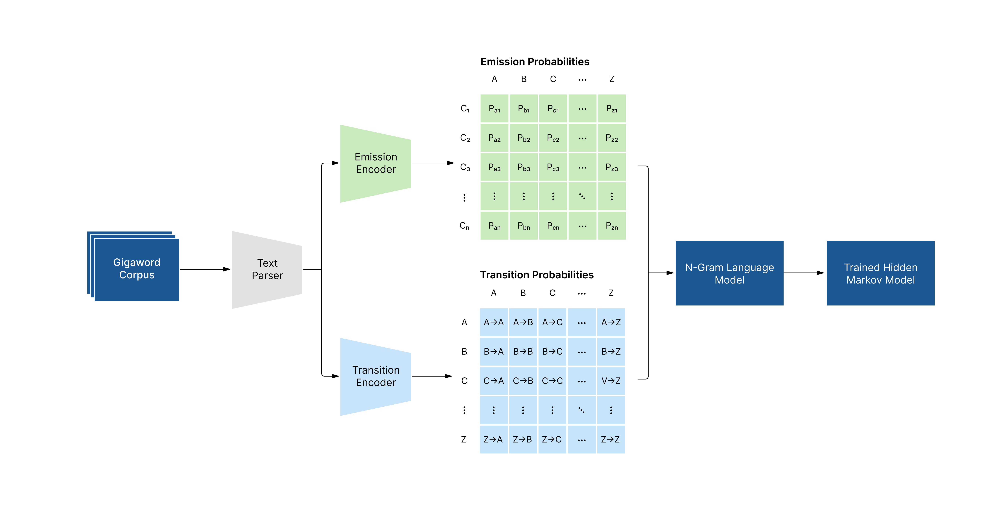
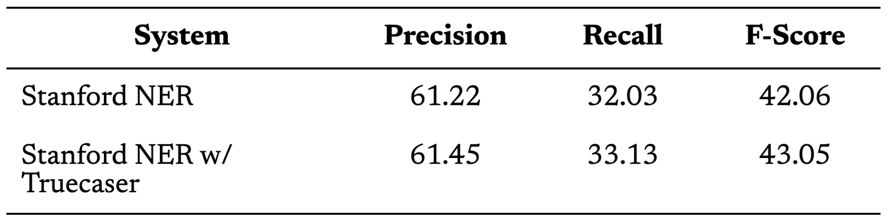

import {InlineContainer, InlineImage, Truecaser, MachineOutput, ResponsiveStacker} from "../../components"

*This write up is a nicer-to-look-at version of a paper I wrote about the truecaser. I took the diagrams, tables, and graphs and made them easier and more fun to read.*

Twitter has become a popular area of research in natural language processing, and particularly information extraction from tweets (Lamb et al., 2013) (Coppersmith et al., 2014) (Zamani et al., 2017). Tweets also provide a uniquely informative compilation of data that is more inclusive than other traditional forms of media, allowing anyone with an account to have a voice (Ritter et al., 2011). A natural idea is to leverage this huge body of information with information extraction. The irregular format and noisy structure of Twitter data, however, present a new challenge for researchers who would like to apply current information extraction techniques to tweets (Ritter et al., 2011).  

&nbsp;&nbsp;&nbsp;&nbsp;&nbsp;&nbsp;&nbsp;&nbsp;&nbsp;&nbsp;&nbsp;&nbsp;&nbsp;One issue that arises in the foundational tasks of named entity recognition (NER) and parts of speech (POS) tagging on tweets is the informal and irregular capitalization of words. Capitalization on Twitter and other micro-blogs is not always used in the same manner we see in news corpora; rather, it may be used in a similar way, to communicate EXCITEMENT, to mOcK sOmEtHiNg, or it may have no meaning at all. Capitalization is a key signal for both NER and POS tagging systems that either a word is a named entity or is a proper noun. Removing the usefulness of that feature results in significantly poorer performance. Mayhew et al. (2019), for example, found that using a state of the art BiLSTM-CRF with ELMo for NER on cased data resulted in an accuracy of 92.45%, and when capitalization (case) is removed, accuracy falls to 34.46%.   

&nbsp;&nbsp;&nbsp;&nbsp;&nbsp;&nbsp;&nbsp;&nbsp;&nbsp;&nbsp;&nbsp;&nbsp;&nbsp;The most straightforward way to address this problem is to normalize capitalization for the tweets. In this write-up I propose a simple system to normalize the case of tweets to improve the performance of existing NER and POS tagging systems. We use a Hidden Markov Model (HMM) with an n-gram language model to calculate the most statistically probable capitalization of a sentence, which when applied as a preprocessing step to NER and POS tasks results in marginal improvement. We evaluate our system on two different gold standard corpora: the first is from Ritter and the second is a new annotated set of 1300 tweets.

## Methodology

<InlineImage>

</InlineImage>

The proposed system, summarized in Figure 1, follows the work by Nehbi et al. (2015) and builds on the toolkit established by Ritter et al. (2011). First, we train a NLTK toolkit’s language model on the subset of the GigaWord corpus and the Ritter Twitter corpus. Next, using the language model’s API, transition and emission probabilities are calculated for bigrams and a custom implemented version of the Viterbi algorithm is used. For each word in the sentence, the Viterbi algorithm decides out of all the observed capitalizations of a particular word, which is most likely in this particular sentence.  

&nbsp;&nbsp;&nbsp;&nbsp;&nbsp;&nbsp;&nbsp;&nbsp;&nbsp;&nbsp;&nbsp;&nbsp;&nbsp;The proposed system consists of a two step pipeline when running the model on a test or evaluation tweet. First, the tweet is converted to all lowercase. Then, the HMM chooses the most likely capitalization structure for the sentence using the Viterbi algorithm. The final output is the sequence of words and their capitalizations which maximize the probability of the sentence. 

## Results and Evaluation

The <aside>To save space, I decided not to include the section applying the truecaser as a preprocessing step to NER and POS systems</aside> system was evaluated on two separate corpora: (1) the Ritter corpus and (2) a custom annotated corpus. 

#### *Ritter Corpus*

The first gold standard corpus used to evaluate the system was the hand annotated Ritter Twitter corpus. The corpus was transformed to all lowercase and the system was run using the lowercase version as input and then compared to the gold standard. We also include a unigram baseline that works by selecting the most common capitalization form for a particular word for each word in the sentence.  

&nbsp;&nbsp;&nbsp;&nbsp;&nbsp;&nbsp;&nbsp;&nbsp;&nbsp;&nbsp;&nbsp;&nbsp;&nbsp;The first evaluation metric chosen was the BLEU score. BLEU is used to compute the similarity between system output and the gold standard based on their n-grams. This is the metric used by Nehbi et al. (2015) to evaluate their LM Truecaser, giving us a point of comparison between the systems.

<InlineImage>

</InlineImage>

The HMM model outperformed the baseline on the Ritter corpus with the HMM scoring 74.62% and the baseline scoring 71.32%. For comparison, the algorithm described in Nehbi et al. (2015) achieved a BLEU score of 78.36% on the Ritter corpus. It is not obvious why the LM truecaser would perform better than the HMM, but one possibility is the difference in the size of the training corpora. The LM truecaser was trained on a larger subsection of the GigaWord corpus, which may contribute to its improved score.  
&nbsp;&nbsp;&nbsp;&nbsp;&nbsp;&nbsp;&nbsp;&nbsp;&nbsp;&nbsp;&nbsp;&nbsp;&nbsp;The difference between the baseline system and the HMM is the bigram language model. The observed increase in performance from the HMM over the baseline, therefore, is demonstrative of the value of context aware bigrams. To illustrate the usefulness of bigrams, consider a short tweet: “where is new haven?” Our unigram system recognizes neither ‘new’ nor ‘haven’ as candidates for capitalization because both ‘new’ and ‘haven’ appear overwhelmingly lowercase in our corpora. The HMM, however, also looks at the probability of the words together, finding the most common capitalization of their combination to be ‘New Haven.’  
&nbsp;&nbsp;&nbsp;&nbsp;&nbsp;&nbsp;&nbsp;&nbsp;&nbsp;&nbsp;&nbsp;&nbsp;&nbsp;A second set of performance statistics were collected using the HMM on the Ritter corpus, namely the precision, recall, and F-score. Collecting these scores, allow for a more rigorous analysis of the errors of our system.

<InlineContainer color="#efefef">

## Applications
In this section, we show the results of experiments running the truecaser as a preprocessing step for tweets prior to NER and POS tagging on the Ritter corpus. 

<InlineImage>

</InlineImage>

</InlineContainer>

<InlineContainer color="#efefef">

## How do you make an HMM?
Maecenas venenatis varius dui in feugiat[^1]. Proin urna elit[^a], tempus nec sollicitudin hendrerit, malesuada in lacus. Etiam arcu quam, condimentum ut feugiat sed, ullamcorper eget purus. Mauris venenatis gravida pulvinar. Duis malesuada aliquet augue, a facilisis tellus lobortis id. Nullam sit amet erat eget sem facilisis elementum.

| Syntax      | Description |
| ----------- | ----------- |
| Header      | Title       |
| Paragraph   | Text        |

</InlineContainer>

## Where do we go from here?
Mauris et venenatis mi. Duis ut volutpat sapien. <aside> Note this is important. I chose to do it like this to prevent overwritting my previous work while still maintaining efficiency. </aside> Pellentesque habitant morbi tristique senectus et netus et malesuada fames ac turpis egestas. Maecenas non risus in felis molestie tincidunt vitae sed dolor. Donec quis sodales est. Phasellus a elementum eros. Phasellus vel velit ut turpis tincidunt vulputate. Donec eleifend nunc orci, sit amet viverra ligula lobortis quis. Nullam semper, lacus id aliquet pharetra, tortor mi commodo dui, sit amet volutpat orci dolor eget lectus. Vestibulum enim risus, elementum vel aliquet non, semper eget nisl. Maecenas pharetra tortor accumsan sem laoreet mattis convallis venenatis massa. Curabitur massa enim, scelerisque in eros nec, tempus rutrum magna. Cras dictum, nunc vel dignissim cursus, tortor nunc bibendum nisl, quis pharetra augue nunc ut odio. Maecenas fringilla purus sit amet enim dictum elementum. Integer a est id urna sagittis pellentesque nec sit amet dui. Duis imperdiet cursus fermentum.

<InlineImage>

</InlineImage>

<ResponsiveStacker>

<MachineOutput
    example_num="1"
    text="my favorite pizza in new york is joe’s"
    examples={[
        {
            id: 0,
            text: "My favorite pizza in <strong>New York</strong> is <strong>Joe’s</strong>",
            percent: '94'
        },
        {
            id: 1,
            text: "My favorite pizza in new york is Joe’s",
            percent: '20'
        },
        {
            id: 2,
            text: "my favorite pizza in new york is joe’s",
            percent: '1'
        }
    ]}
/>
<MachineOutput
    example_num="2"
    text="my favorite pizza in new york is joe’s"
    examples={[
        {
            id: 0,
            text: "My favorite pizza in <strong>New York</strong> is <strong>Joe’s</strong>",
            percent: '94'
        },
        {
            id: 1,
            text: "My favorite pizza in new york is Joe’s",
            percent: '20'
        },
        {
            id: 2,
            text: "my favorite pizza in new york is joe’s",
            percent: '1'
        }
    ]}
/>
<MachineOutput
    example_num="2"
    text="my favorite pizza in new york is joe’s"
    examples={[
        {
            id: 0,
            text: "My favorite pizza in <strong>New York</strong> is <strong>Joe’s</strong>",
            percent: '94'
        },
        {
            id: 1,
            text: "My favorite pizza in new york is Joe’s",
            percent: '20'
        },
        {
            id: 2,
            text: "my favorite pizza in new york is joe’s",
            percent: '1'
        }
    ]}
/>
<MachineOutput
    example_num="2"
    text="my favorite pizza in new york is joe’s"
    examples={[
        {
            id: 0,
            text: "My favorite pizza in <strong>New York</strong> is <strong>Joe’s</strong>",
            percent: '94'
        },
        {
            id: 1,
            text: "My favorite pizza in new york is Joe’s",
            percent: '20'
        },
        {
            id: 2,
            text: "my favorite pizza in new york is joe’s",
            percent: '1'
        }
    ]}
/>

</ResponsiveStacker>

# We also want a CAPTION under the images

<Truecaser/>

## We're lacking complexity right?
*You're right.* We've missed a huge portion of economic theory. Can we really ignore the effects of an open economy? Nope. But we will.

Mauris et venenatis mi. Duis ut volutpat sapien. <aside> Note this is important. I chose to do it like this to prevent overwritting my previous work while still maintaining efficiency. </aside> Pellentesque habitant morbi tristique senectus et netus et malesuada fames ac turpis egestas. Maecenas non risus in felis molestie tincidunt vitae sed dolor. Donec quis sodales est. Phasellus a elementum eros. Phasellus vel velit ut turpis tincidunt vulputate. Donec eleifend nunc orci, sit amet viverra ligula lobortis quis. Nullam semper, lacus id aliquet pharetra, tortor mi commodo dui, sit amet volutpat orci dolor eget lectus. Vestibulum enim risus, elementum vel aliquet non, semper eget nisl. Maecenas pharetra tortor accumsan sem laoreet mattis convallis venenatis massa. Curabitur massa enim, scelerisque in eros nec, tempus rutrum magna. Cras dictum, nunc vel dignissim cursus, tortor nunc bibendum nisl, quis pharetra augue nunc ut odio. Maecenas fringilla purus sit amet enim dictum elementum. Integer a est id urna sagittis pellentesque nec sit amet dui. Duis imperdiet cursus fermentum.

[^1]: Footnote.
[^a]: Hello.